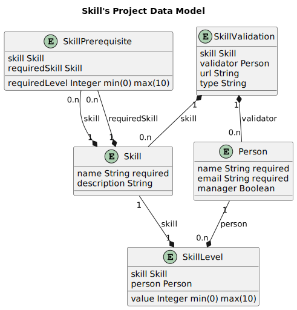

# Retours sur l'existant du projet Skill's project

## 1. Etat des lieux de l'existant

### 1.1 Technologies utilisées

#### 1.1.1 Frontend

Le frontend est développé en `Typescript` avec le framework `React`. 
Il utilise `Redux` pour la gestion des états et axios pour les requêtes HTTP vers l'API backend.

#### 1.1.2 Backend

Le backend est développé en Java avec le framework Spring Boot.
Il utilise Spring Data JPA pour la gestion de la base de données et Spring Security pour la gestion des utilisateurs.

Il ne propose pas de base de données, il utilise une base de données embarquée H2.

### 1.1.3 Base de données

H2 est une base de données embarquée, elle n'est pas faite pour être utilisée en production.

### 1.2 Fonctionnalités

#### 1.2.1 Fonctionnalités actuelles

L'application permet de gérer des compétences (Skills), des niveaux de competences (SkillLevel), des prérequis (SkillPrerequisite) et des utilisateurs (User).
Elle permet de créer, modifier, supprimer et lister ces entités.

#### 1.2.2 Fonctionnalités manquantes

Aucune des logiques n'est actuellement implémentée.

Deplus, la gestion des équipes (Team) n'est pas implémentée.

#### 1.2.3 Fonctionnalités en trop

L'application actuelle propose du monitoring et des gestions qui ne sont pas demandées dans le cahier des charges.

#### 1.2.4 Fonctionnalités à modifier

L'interface utilisateur ne répond pas aux besoins du client.

#### 1.2.5 Fonctionnalités mal implémentées

L'application actuelle ne respecte pas les bonnes pratiques de développement.

## 2. Defaults de l'application liée aux exigences

### 2.1 Fonctionnel

Aucune donnée n'est actuellement gérée par l'application.

Elle ne gère que l'authentification des utilisateurs.

### 2.2 Non fonctionnel

L'application n'est pas déployée.

## Tableau de correspondance entre les exigences et les fonctionnalités actuelles

[Tableau de correspondance entre les exigences et les fonctionnalités actuelles](srs-plan.xlsx)

## 4. Liste des problèmes dans le code et dans l'architecture de l'application existante

### 4.1 Vulnérabilité

L'application actuelle possède des vulnérabilités de sécurité dues à l'utilisation de dépendances obsolètes.
La webapp possède 7 vulnérabilités (5 hautes et 2 critiques)

### 4.2 Authentification
L'application utilise le mot de passe par défaut de Jhipster pour l'authentification des utilisateurs.
C'est une faille de sécurité.

### 4.3 Autorisation

L'application n'utilise pas d'autorisation.

### 4.4 Modèle de données

Le modèle de données actuel cible (trouvé dans le fichier [audit.jpl](../../audit.jdl)) n'est pas le même que celui utilisé par l'application actuelle.)) :

Voici le modèle de données qu'il décrit :

Il ne correspond pas au modèle de données demandé par le client.
Il ne prend pas en compte les équipes (Team).

Deplus, certaines relations ne sont pas judicieuses.
* Ce sont les SkillLevel qui possèdent les Person et non l'inverse. 
Hors dans la logique métier, c'est l'utilisateur qui possède un niveau de compétence.
* Idem pour les SkillPrerequisite, ce sont les SkillPrequisite qui possèdent les Skill et non l'inverse.
Hors dans la logique métier, c'est la compétence qui possède un prérequis.

Cette structure de données peut entrainer une complication du code et une perte de performance.

### 4.5 Architecture Applicative

Le choix d'une architecture purement monolithique n'est pas judicieux. Elle ne permet pas de répondre aux besoins du client et rend 
l'évolution de l'application difficile.

La partie Frontend (React) est directement intégrée dans le projet Spring Boot. Cette structure mélange les technologies et rend
l'application difficilement maintenable.

### 4.6 La base de données

La base de données actuelle est une base de données H2 en mémoire. Elle n'est donc pas persistante et n'est utilisable
que pour les tests et le développement. Elle ne permet pas de répondre aux besoins du client.

### 4.7 Architecture Logicielle

Le code du backend n'est pas forcement le plus lisible. L'utilisation de jhipster peut être une bonne chose
car il met en place une architecture de base, mais il faut la modifier pour qu'elle corresponde aux besoins du client.

Actuellement, l'application utilise une architecture 2 couche (Controller/Repository).
Cette architecture rend plus complexe l'ajout de nouvelles fonctionnalités.

### 4.8 Jhipster

Jhipster est un générateur de projet qui permet de générer une application Spring Boot avec une partie Frontend en React.

Il ajoute dans le code des dépendances qui ne sont pas forcement utilisées. Il est donc nécessaire de faire le ménage dans le code.

## Conclusion

Cette application n'est pas de bonne qualité et ne répond pas aux besoins du client.

Il est surement préférable de la refaire complètement.
