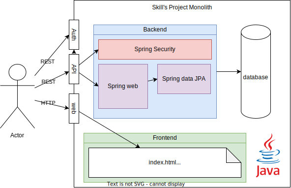

# Exercice Préparation et analyse de l'existant

## Curative
Faire un etat des lieux de l'existant et de la situation actuelle de l'application.
- Lister les technologies utilisées
- - Voir si l'application fonctionne (build, tests, lancement)
    - Build : OK
    - Tests : OK
    - Lancement : OK
- Faire le Model de données actuellement utiliser par l'application
    - 
- Faire le schema d'architecture de l'application
    - 
- Faire une comparaison entre ce que l'application fait et ce que l'application devrait faire
- Lister les problèmes dans le code et dans l'architecture de l'application existante

Regrouper l'ensemble de ces informations dans un document.
1. Etat des lieux de l'existant (technologies, schema d'architecture, model de données, ...)
2. Defaults de l'application
3. Tableau de l'état des foctionnalités
4. Liste des problèmes dans le code et dans l'architecture de l'application existante
