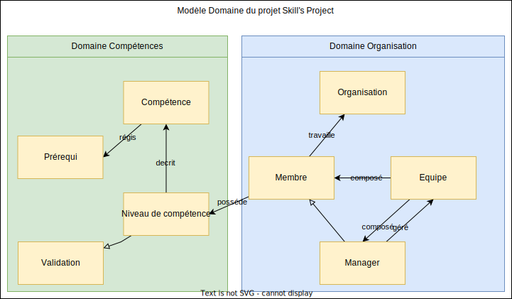

# Proposition de solution pour le Projet SRS

## Présentation

Vous trouverez les exigences et informations du projet dans le [SRS](../SRS.md)

## Domaine Métier de l'application



L'application évolue dans le cadre des organisations comme les entreprises.

Elle est mise en place dans une organisation qui comporte des `Membres` regroupés en `Equipe`.
Certains sont des `Manager` qui gèrent les Membres des équipes.

Les Membres ont un certain niveau sur chaque `Skill` (compétence) qui est défini par un `SkillLevel` (niveau de compétence).

## Choix de l'architecture

### Architecture Applicative

Il y a plusieurs possibilités pour l'architecture de l'application:
* Monolithique
  - [x] Une seule application qui contient tout le code
  - [x] Facile à Déployer
  - [x] Adapté aux petites applications
  - [ ] Difficile à maintenir pour les évolutions
  - [ ] Couplage fort entre les composants
  - [ ] Difficilement scalable
* 3 Tiers: Frontend, Backend et Base de données
  - [x] Facile à maintenir pour les évolutions
  - [x] Adapté aux petites et moyennes applications
  - [x] Facile à Déployer
  - [x] Couplage plus faible que le monolithique
  - [ ] Scalabilité limitée
* SOA
  - [x] Plus scalable que le 3 Tiers
  - [x] Facile à maintenir pour les évolutions
  - [ ] Adapté aux grandes applications
  - [ ] Demande plus de compétences pour le développement
  - [ ] Plus difficile à déployer
* Microservices
   - [x] Plus scalable que le SOA
   - [x] Haute disponibilité
   - [x] Facile à maintenir pour les évolutions
   - [ ] Adapté aux grandes applications
   - [ ] Demande plus de compétences pour le développement
   - [ ] Demande plus d'outil pour le déploiement
   - [ ] Temps de développement plus long au depart

L'architecture choisie est le `3 Tiers`.

### Architecture Backend

Il existe plusieurs possibilités pour l'architecture du Backend:
- 3 Couches: Controller, Services et Repository
  - [x] Facile à développer
  - [x] Facile à structurer
  - [x] Adapté aux petites et moyennes applications
  - [ ] Effet spaghetti quand le code devient trop complexe
  - [ ] Couplage fort entre les métiers
- Clean Architecture
  - [x] Faible couplage entre les métiers
  - [x] Facilité pour la transformation en microservices
  - [x] Facilité pour la mise en place des tests et de la TDD
  - [x] Adapter pour le code complexe
  - [ ] Plus difficile à développer
  - [ ] Plus difficile à structurer

Pour le Backend, l'architecture choisie est la `Clean Architecture`.


### Architecture Frontend

Il existe plusieurs possibilités pour l'architecture du Frontend:
- Mono-Module
  - [x] Facile à développer
  - [ ] Effet spaghetti
  - [ ] Couplage fort entre les composants
  - [ ] Difficile à maintenir
- Multi-Module
  - [x] Facile à développer
  - [x] Facile à structurer

Pour le Frontend, l'architecture choisie est le `Multi-Module`.

## Choix des technologies

### Base de données

Il existe plusieurs possibilités pour la base de données:
- PostgresQL (NewSQL)
  - [x] Relationnel
  - [x] structuré
  - [ ] DBfirst
  - [ ] Faiblement scalable
- MongoDB (NoSQL)
  - [x] Orienté document
  - [x] Non structuré
  - [x] Codefirst : plus simple pour le développement
  - [x] Scalable

Le choix de la base de données est `MongoDB`.

```json
{
    "id": "5f9f5b9b9b9b9b9b9b9b9b9b",
    "nom": "Java",
    "description": "Langage de programmation",
    "prerequis": [
        {
            "id": "5f9f5b9b9b9b9b9b9b9b9b9c",
            "type": "niveau",
            "competencesAAvoir": ["5f9f5b9b9b9b9b9b9b9b9b9b"],
            "niveauCible": 5,
            "niveauDeCompetenceAAvoir": 5
        },{
            "id": "5f9f5b9b9b9b9b9b9b9b9b9d",
            "type": "pair",
            "nieauCible": 6,
            "niveauValidateur": 7
        }
    ]
}
```
```javascript
var col = db.getCollection("skills");
col.find({"prerequis.type": "pair"});
```


### Backend

#### Framework
- Spring
  - [x] Facile à développer
  - [x] Facile à structurer
  - [x] Adapté à toutes les tailles d'applications
  - [x] Grande communauté
  - [x] Grande documentation
  - [ ] lent au démarrage
- NestJS
  - [x] Facile à développer
  - [x] Proche du Framework Angular
  - [x] Adapté aux applications de taille moyenne
  - [ ] Plus petite communauté
- ASP.NET Core
  - [x] C#
  - [x] Facile à développer
  - [x] Adapté à toutes les tailles d'applications
  - [x] Grande communauté
  - [ ] Code plus difficile à pendre en main
- Laravel
    - Manque de structure pour la Clean Architecture
    - PHP n'est pas orienté objet (pas de vrai typage, seulement un speudo typage)

Spring boot etant une technologie Java, il est plus facile de trouver des développeurs Java pour le projet.
Il est fortement structuré et adapté pour la Clean Architecture.

#### ORM

Spring propose un ORM pour la base de données MongoDB: `Spring Data MongoDB`.

Il est facile à utiliser et permet de faire des requêtes sur les bases de données `MongoDB.

### Frontend

#### Framework

- Angular
  - [x] Facile à développer
  - [x] Grande communauté
  - [x] Grande documentation
  - [x] Adapté aux applications de taille petite et moyenne
  - [x] Propose des solutions de génération de code depuis un modèle (Figma)
  - [ ] Peut devenir lourd à maintenir
  - [ ] Plus lourd à developer que ses concurrents
- React
  - [x] Facile à développer
  - [x] Grande communauté
  - [x] Grande documentation
  - [x] Adapté aux applications de taille petite et moyenne
  - [x] Plus léger à développer que Angular
  - [x] Propose des solutions de génération de code depuis un modèle (Figma)

Le choix du framework est `React`. En utilisant Figm, il est possible de générer le code du Frontend à partir du modèle.
Il ne manquera plus qu'à le personnaliser pour fair les appels au Backend.

## Choix des outils

### Pour le développement Frontend

* `Figma` est une solution de modélisation de site web. Il est possible de générer le code du Frontend à partir du modèle.
* `Visual Studio Code` est un éditeur de code open source. Il est possible d'installer des extensions pour faciliter le développement.

### Pour le développement Backend

* `IntelliJ IDEA` est un IDE Java. Il est possible d'installer des plugins pour faciliter le développement.
* `Spring Initializr` est un générateur de projet Spring. Il permet de générer un projet Spring Boot avec les dépendances nécessaires.
* `Postman` est un outil de test d'API. Il permet de tester les API du Backend.
* `JUnit 5` est un framework de test unitaire. Il permet de tester les classes du Backend.
* `Mockito` pour l'aide au développement des tests unitaires et d'intégration.
* `Cucumber` pour faire de la BDD.
* `MongoEmbeded` pour faire des tests d'intégration avec une base de données MongoDB en mémoire.
* `Docker` pour le développement et le déploiement.

### CI

* `SonarQube` pour l'analyse de code.
* `Github Action` pour l'atomatisation des tests en pipeline.

### Outils de versionning

* `Git` pour le versionning du code.
* `Github` pour le stockage du code.

### Outils de gestion de projet

* `Jira` pour la gestion de projet.

### Deploiement

* location de VM sur `OVH` pour le déploiement du Backend.
* `Docker` pour le déploiement du Frontend.
* `Docker Registry` pour le stockage des images Docker.
